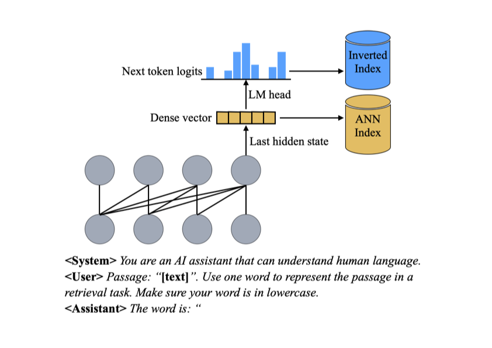

# PromptReps
[](https://arxiv.org/abs/2404.18424)

[PromptReps: Prompting Large Language Models to Generate Dense and Sparse Representations for Zero-Shot Document Retrieval](https://arxiv.org/pdf/2404.18424), Shengyao Zhuang, Xueguang Ma, Bevan Koopman, Jimmy Lin and Guido Zuccon.

<p align="center">
  
</p>


## Updates
- 17/06/2024: Arxiv v2 is online. We have updated the paper with more experiments and results, including investigations on the impact of different prompts and the alternative representations. We also refactored the code.

## Installation
We recommend using a conda environment to install the required dependencies.
```bash
conda create -n promptreps python=3.10
conda activate promptreps

# clone this repo
git clone https://github.com/ielab/PromptReps.git
cd PromptReps
```
Our code is build on top of the [Tevatron](https://github.com/texttron/tevatron) library. To install the required dependencies, run the following command:
> Note: our code is tested with Tevatron main branch with commit id d1816cf.
```bash
git clone https://github.com/texttron/tevatron.git

cd tevatron
pip install transformers datasets peft
pip install deepspeed accelerate
pip install faiss-cpu # or 'conda install pytorch::faiss-gpu' for faiss gpu search
pip install nltk
pip install -e .
cd ..
```
We also use [Pyserini](https://github.com/castorini/pyserini/tree/master) to build inverted index for sparse representations and evaluate the results. 
To install it, run the following command:
```bash
conda install -c conda-forge openjdk=21 maven -y
pip install pyserini
```
If you have any issues with the pyserini installation, please follow this [link](https://github.com/castorini/pyserini/blob/master/docs/installation.md).

---
## Python code example

```python3
from transformers import AutoModelForCausalLM, AutoTokenizer
import torch
import numpy as np
from nltk import word_tokenize
from nltk.corpus import stopwords
import string
stopwords = set(stopwords.words('english') + list(string.punctuation))

model_id = "meta-llama/Meta-Llama-3-8B-Instruct"

tokenizer = AutoTokenizer.from_pretrained(model_id)
model = AutoModelForCausalLM.from_pretrained(
    model_id,
    torch_dtype=torch.bfloat16,
    device_map="auto",
)

passage = "The quick brown fox jumps over the lazy dog."
messages = [
    {"role": "system", "content": "You are an AI assistant that can understand human language."},
    {"role": "user", "content": f'Passage: "{passage}". Use one word to represent the passage in a retrieval task. Make sure your word is in lowercase.'},
    {"role": "assistant", "content": 'The word is "'}
]

input_ids = tokenizer.apply_chat_template(
    messages,
    add_generation_prompt=False,
    return_tensors="pt"
)[:, :-1].to(model.device)  # the last special token is removed

outputs = model(input_ids=input_ids, return_dict=True, output_hidden_states=True)

# dense representation
next_token_reps = outputs.hidden_states[-1][:, -1, :][0]

# sparse representation
next_token_logits = outputs.logits[:, -1, :][0]
words_in_text = [word for word in word_tokenize(passage.lower()) if word not in stopwords]
token_ids_in_text = set()
for word in words_in_text:
    token_ids_in_text.update(tokenizer.encode(word, add_special_tokens=False))
token_ids_in_text = torch.tensor(list(token_ids_in_text))

top_k = min(len(token_ids_in_text), 128)
top_k_values, top_k_indices = next_token_logits[token_ids_in_text].topk(top_k, dim=-1)
values = np.rint(top_k_values.cpu().detach().float().numpy() * 100).astype(int)
tokens = [tokenizer.decode(i) for i in token_ids_in_text[top_k_indices.cpu().detach().float().numpy()]]

print({token: value for token, value in zip(tokens, values)})
# {'fox': 2162, 'dog': 1538, 'brown': 1475, 'j': 1438, 'quick': 1319, 'lazy': 1206, 'umps': 323}
```

## BEIR Example
In this example, we show an experiment with nfcorpus dataset from [BEIR](https://github.com/beir-cellar/beir) using the [meta-llama/Meta-Llama-3-8B-Instruct](https://huggingface.co/meta-llama/Meta-Llama-3-8B-Instruct) model. 
### Step 0: Setup the environment variables.

```bash
BASE_MODEL=meta-llama/Meta-Llama-3-8B-Instruct
DATASET=nfcorpus
OUTPUT_DIR=outputs/${BASE_MODEL}/
```
You can change experiments with other LLMs on huggingface model hub by changing the `BASE_MODEL` variable. 
But you may also need to add prompts in `prompts/${BASE_MODEL}` directory.

Similarly, you can change the dataset by changing the `DATASET` variable to other BEIR dataset names listed [here](https://github.com/beir-cellar/beir?tab=readme-ov-file#beers-available-datasets).

We store the results and intermediate files in the `OUTPUT_DIR` directory.

---

### Step 1: Encode dense and sparse representation of documents in the corpus.
For large corpus, we shard the document collection and encode each shard in parallel with multiple GPUs.

For example, if you have two GPUs:
```bash
NUM_AVAILABLE_GPUS=2
for i in $(seq 0 $((NUM_AVAILABLE_GPUS-1)))
do
CUDA_VISIBLE_DEVICES=${i} python encode.py \
        --output_dir=temp \
        --model_name_or_path ${BASE_MODEL} \
        --tokenizer_name ${BASE_MODEL} \
        --per_device_eval_batch_size 64 \
        --passage_max_len 512 \
        --normalize \
        --bf16 \
        --dataset_name Tevatron/beir-corpus \
        --dataset_config ${DATASET} \
        --dense_output_dir ${OUTPUT_DIR}/beir/${DATASET}/dense \
        --sparse_output_dir ${OUTPUT_DIR}/beir/${DATASET}/sparse \
        --passage_prefix prompts/${BASE_MODEL}/passage_prefix.txt \
        --passage_suffix prompts/${BASE_MODEL}/passage_suffix.txt \
        --cache_dir cache_models \
        --dataset_cache_dir cache_datasets \
        --dataset_number_of_shards ${NUM_AVAILABLE_GPUS} \
        --dataset_shard_index ${i} &
done
wait
```

---

### Step 2: Build sparse index.
```bash
python -m pyserini.index.lucene \
  --collection JsonVectorCollection \
  --input ${OUTPUT_DIR}/beir/${DATASET}/sparse/ \
  --index ${OUTPUT_DIR}/beir/${DATASET}/sparse/index \
  --generator DefaultLuceneDocumentGenerator \
  --threads 16 \
  --impact --pretokenized
```

### Step 3: Retireval.
```bash
python search.py \
    --output_dir=temp \
    --model_name_or_path ${BASE_MODEL} \
    --tokenizer_name ${BASE_MODEL} \
    --batch_size 32 \
    --threads 16 \
    --query_max_len 512 \
    --passage_max_len 512 \
    --normalize \
    --dataset_name Tevatron/beir \
    --dataset_config ${DATASET} \
    --dataset_split test \
    --bf16 \
    --query_prefix prompts/${BASE_MODEL}/query_prefix.txt \
    --query_suffix prompts/${BASE_MODEL}/query_suffix.txt \
    --cache_dir cache_models \
    --encode_is_query \
    --dataset_cache_dir cache_datasets \
    --passage_reps ${OUTPUT_DIR}'/beir/'${DATASET}'/dense/' \
    --sparse_index ${OUTPUT_DIR}/beir/${DATASET}/sparse/ \
    --alpha 0.5 \
    --depth 1000 \
    --save_dir ${OUTPUT_DIR}/beir/${DATASET}/results/ \
    --use_gpu \
    --remove_query
```

---

### Step 4: Evaluate the results:

```bash
# Dense results
python -m pyserini.eval.trec_eval -c -m recall.100,1000 -m ndcg_cut.10 beir-v1.0.0-${DATASET}-test  ${OUTPUT_DIR}/beir/${DATASET}/results/rank.dense.trec

#Sparse results
python -m pyserini.eval.trec_eval -c -m recall.100,1000 -m ndcg_cut.10 beir-v1.0.0-${DATASET}-test ${OUTPUT_DIR}/beir/${DATASET}/results/rank.sparse.trec

#Hybrid results
python -m pyserini.eval.trec_eval -c -m recall.100,1000 -m ndcg_cut.10 beir-v1.0.0-${DATASET}-test ${OUTPUT_DIR}/beir/${DATASET}/results/rank.hybrid.trec
```

You will get the following results:
```
Dense results:
recall_100              all     0.2879
recall_1000             all     0.6192
ndcg_cut_10             all     0.2956

Sparse results:
recall_100              all     0.2363
recall_1000             all     0.4371
ndcg_cut_10             all     0.2818

Hybrid results:
recall_100              all     0.2939
recall_1000             all     0.6180
ndcg_cut_10             all     0.3298
```
---
## Alternative representations
<details>
<summary>First-word single-representation</summary>

```bash
# Step 0
BASE_MODEL=meta-llama/Meta-Llama-3-8B-Instruct
DATASET=nfcorpus
OUTPUT_DIR=outputs/${BASE_MODEL}/first_word_single_rep/

# Step 1
NUM_AVAILABLE_GPUS=1
for i in $(seq 0 $((NUM_AVAILABLE_GPUS-1)))
do
CUDA_VISIBLE_DEVICES=${i} python encode.py \
        --output_dir=temp \
        --model_name_or_path ${BASE_MODEL} \
        --tokenizer_name ${BASE_MODEL} \
        --per_device_eval_batch_size 32 \
        --passage_max_len 512 \
        --normalize \
        --bf16 \
        --dataset_name Tevatron/beir-corpus \
        --dataset_config ${DATASET} \
        --dense_output_dir ${OUTPUT_DIR}/beir/${DATASET}/dense \
        --sparse_output_dir ${OUTPUT_DIR}/beir/${DATASET}/sparse \
        --passage_prefix prompts/${BASE_MODEL}/passage_prefix.txt \
        --passage_suffix prompts/${BASE_MODEL}/passage_suffix.txt \
        --cache_dir cache_models \
        --dataset_cache_dir cache_datasets \
        --dataset_number_of_shards ${NUM_AVAILABLE_GPUS} \
        --dataset_shard_index ${i} \
        --word_level_reps \
        --num_pooled_tokens 10 &
done
wait

# Step 2
python -m pyserini.index.lucene \
  --collection JsonVectorCollection \
  --input ${OUTPUT_DIR}/beir/${DATASET}/sparse/ \
  --index ${OUTPUT_DIR}/beir/${DATASET}/sparse/index \
  --generator DefaultLuceneDocumentGenerator \
  --threads 16 \
  --impact --pretokenized

# Step 3
python search.py \
    --output_dir=temp \
    --model_name_or_path ${BASE_MODEL} \
    --tokenizer_name ${BASE_MODEL} \
    --batch_size 32 \
    --threads 16 \
    --query_max_len 512 \
    --passage_max_len 512 \
    --normalize \
    --dataset_name Tevatron/beir \
    --dataset_config ${DATASET} \
    --dataset_split test \
    --bf16 \
    --query_prefix prompts/${BASE_MODEL}/query_prefix.txt \
    --query_suffix prompts/${BASE_MODEL}/query_suffix.txt \
    --cache_dir cache_models \
    --encode_is_query \
    --dataset_cache_dir cache_datasets \
    --passage_reps ${OUTPUT_DIR}'/beir/'${DATASET}'/dense/' \
    --sparse_index ${OUTPUT_DIR}/beir/${DATASET}/sparse/ \
    --alpha 0.5 \
    --depth 1000 \
    --save_dir ${OUTPUT_DIR}/beir/${DATASET}/results/ \
    --use_gpu \
    --remove_query \
    --word_level_reps \
    --num_pooled_tokens 10

# Step 4
python -m pyserini.eval.trec_eval -c -m recall.100,1000 -m ndcg_cut.10 beir-v1.0.0-${DATASET}-test  ${OUTPUT_DIR}/beir/${DATASET}/results/rank.dense.trec
python -m pyserini.eval.trec_eval -c -m recall.100,1000 -m ndcg_cut.10 beir-v1.0.0-${DATASET}-test ${OUTPUT_DIR}/beir/${DATASET}/results/rank.sparse.trec
python -m pyserini.eval.trec_eval -c -m recall.100,1000 -m ndcg_cut.10 beir-v1.0.0-${DATASET}-test ${OUTPUT_DIR}/beir/${DATASET}/results/rank.hybrid.trec
```
You will get the following results:
```
Dense results:
recall_100              all     0.1997
recall_1000             all     0.5302
ndcg_cut_10             all     0.2198

Sparse results:
recall_100              all     0.2365
recall_1000             all     0.4370
ndcg_cut_10             all     0.2915

Hybrid results:
recall_100              all     0.2643
recall_1000             all     0.5682
ndcg_cut_10             all     0.2949
```
</details>

<details>
<summary>Multi-token single-representation</summary>

```bash
# Step 0
BASE_MODEL=meta-llama/Meta-Llama-3-8B-Instruct
DATASET=nfcorpus
OUTPUT_DIR=outputs/${BASE_MODEL}/multi_token_single_rep/

# Step 1
NUM_AVAILABLE_GPUS=1
for i in $(seq 0 $((NUM_AVAILABLE_GPUS-1)))
do
CUDA_VISIBLE_DEVICES=${i} python encode.py \
        --output_dir=temp \
        --model_name_or_path ${BASE_MODEL} \
        --tokenizer_name ${BASE_MODEL} \
        --per_device_eval_batch_size 32 \
        --passage_max_len 512 \
        --normalize \
        --bf16 \
        --dataset_name Tevatron/beir-corpus \
        --dataset_config ${DATASET} \
        --dense_output_dir ${OUTPUT_DIR}/beir/${DATASET}/dense \
        --sparse_output_dir ${OUTPUT_DIR}/beir/${DATASET}/sparse \
        --passage_prefix prompts/${BASE_MODEL}/passage_prefix.txt \
        --passage_suffix prompts/${BASE_MODEL}/passage_suffix_multi.txt \
        --cache_dir cache_models \
        --dataset_cache_dir cache_datasets \
        --dataset_number_of_shards ${NUM_AVAILABLE_GPUS} \
        --dataset_shard_index ${i} \
        --num_pooled_tokens 10 &
done
wait

# Step 2
python -m pyserini.index.lucene \
  --collection JsonVectorCollection \
  --input ${OUTPUT_DIR}/beir/${DATASET}/sparse/ \
  --index ${OUTPUT_DIR}/beir/${DATASET}/sparse/index \
  --generator DefaultLuceneDocumentGenerator \
  --threads 16 \
  --impact --pretokenized

# Step 3
python search.py \
    --output_dir=temp \
    --model_name_or_path ${BASE_MODEL} \
    --tokenizer_name ${BASE_MODEL} \
    --batch_size 32 \
    --threads 16 \
    --query_max_len 512 \
    --passage_max_len 512 \
    --normalize \
    --dataset_name Tevatron/beir \
    --dataset_config ${DATASET} \
    --dataset_split test \
    --bf16 \
    --query_prefix prompts/${BASE_MODEL}/query_prefix.txt \
    --query_suffix prompts/${BASE_MODEL}/query_suffix_multi.txt \
    --cache_dir cache_models \
    --encode_is_query \
    --dataset_cache_dir cache_datasets \
    --passage_reps ${OUTPUT_DIR}'/beir/'${DATASET}'/dense/' \
    --sparse_index ${OUTPUT_DIR}/beir/${DATASET}/sparse/ \
    --alpha 0.5 \
    --depth 1000 \
    --save_dir ${OUTPUT_DIR}/beir/${DATASET}/results/ \
    --use_gpu \
    --remove_query \
    --num_pooled_tokens 10

# Step 4
python -m pyserini.eval.trec_eval -c -m recall.100,1000 -m ndcg_cut.10 beir-v1.0.0-${DATASET}-test  ${OUTPUT_DIR}/beir/${DATASET}/results/rank.dense.trec
python -m pyserini.eval.trec_eval -c -m recall.100,1000 -m ndcg_cut.10 beir-v1.0.0-${DATASET}-test ${OUTPUT_DIR}/beir/${DATASET}/results/rank.sparse.trec
python -m pyserini.eval.trec_eval -c -m recall.100,1000 -m ndcg_cut.10 beir-v1.0.0-${DATASET}-test ${OUTPUT_DIR}/beir/${DATASET}/results/rank.hybrid.trec
```
You will get the following results:
```
Dense results:
recall_100              all     0.2956
recall_1000             all     0.6343
ndcg_cut_10             all     0.2897

Sparse results:
recall_100              all     0.2386
recall_1000             all     0.4416
ndcg_cut_10             all     0.2865

Hybrid results:
recall_100              all     0.3056
recall_1000             all     0.6388
ndcg_cut_10             all     0.3365
```
</details>

<details>
<summary>Multi-token multi-representation</summary>

```bash
# Step 0
BASE_MODEL=meta-llama/Meta-Llama-3-8B-Instruct
DATASET=nfcorpus
OUTPUT_DIR=outputs/${BASE_MODEL}/multi_token_multi_rep/

# Step 1
NUM_AVAILABLE_GPUS=1
for i in $(seq 0 $((NUM_AVAILABLE_GPUS-1)))
do
CUDA_VISIBLE_DEVICES=${i} python encode.py \
        --output_dir=temp \
        --model_name_or_path ${BASE_MODEL} \
        --tokenizer_name ${BASE_MODEL} \
        --per_device_eval_batch_size 32 \
        --passage_max_len 512 \
        --normalize \
        --bf16 \
        --dataset_name Tevatron/beir-corpus \
        --dataset_config ${DATASET} \
        --dense_output_dir ${OUTPUT_DIR}/beir/${DATASET}/dense \
        --sparse_output_dir ${OUTPUT_DIR}/beir/${DATASET}/sparse \
        --passage_prefix prompts/${BASE_MODEL}/passage_prefix.txt \
        --passage_suffix prompts/${BASE_MODEL}/passage_suffix_multi.txt \
        --cache_dir cache_models \
        --dataset_cache_dir cache_datasets \
        --dataset_number_of_shards ${NUM_AVAILABLE_GPUS} \
        --dataset_shard_index ${i} \
        --multi_reps \
        --num_pooled_tokens 10 &
done
wait

# Step 2
for i in $(seq 0 9); do
  python -m pyserini.index.lucene \
    --collection JsonVectorCollection \
    --input ${OUTPUT_DIR}/beir/${DATASET}/sparse/rep-${i} \
    --index ${OUTPUT_DIR}/beir/${DATASET}/sparse/rep-${i}/index \
    --generator DefaultLuceneDocumentGenerator \
    --threads 16 \
    --impact --pretokenized
done

# Step 3
python search.py \
    --output_dir=temp \
    --model_name_or_path ${BASE_MODEL} \
    --tokenizer_name ${BASE_MODEL} \
    --batch_size 32 \
    --threads 16 \
    --query_max_len 512 \
    --passage_max_len 512 \
    --normalize \
    --dataset_name Tevatron/beir \
    --dataset_config ${DATASET} \
    --dataset_split test \
    --bf16 \
    --query_prefix prompts/${BASE_MODEL}/query_prefix.txt \
    --query_suffix prompts/${BASE_MODEL}/query_suffix_multi.txt \
    --cache_dir cache_models \
    --encode_is_query \
    --dataset_cache_dir cache_datasets \
    --passage_reps ${OUTPUT_DIR}'/beir/'${DATASET}'/dense/' \
    --sparse_index ${OUTPUT_DIR}/beir/${DATASET}/sparse/ \
    --alpha 0.5 \
    --depth 1000 \
    --save_dir ${OUTPUT_DIR}/beir/${DATASET}/results/ \
    --use_gpu \
    --remove_query \
    --multi_reps \
    --num_pooled_tokens 10

# Step 4
python -m pyserini.eval.trec_eval -c -m recall.100,1000 -m ndcg_cut.10 beir-v1.0.0-${DATASET}-test  ${OUTPUT_DIR}/beir/${DATASET}/results/rank.dense.trec
python -m pyserini.eval.trec_eval -c -m recall.100,1000 -m ndcg_cut.10 beir-v1.0.0-${DATASET}-test ${OUTPUT_DIR}/beir/${DATASET}/results/rank.sparse.trec
python -m pyserini.eval.trec_eval -c -m recall.100,1000 -m ndcg_cut.10 beir-v1.0.0-${DATASET}-test ${OUTPUT_DIR}/beir/${DATASET}/results/rank.hybrid.trec
```
You will get the following results:
```
Dense results:
recall_100              all     0.2825
recall_1000             all     0.6378
ndcg_cut_10             all     0.2568

Sparse results:
recall_100              all     0.2354
recall_1000             all     0.4408
ndcg_cut_10             all     0.2515

Hybrid results:
recall_100              all     0.2992
recall_1000             all     0.6419
ndcg_cut_10             all     0.3095
```
> Note: the sparse results and so that hybrid results are insignificantly different from what was reported in the paper likely due to different mixed precision inference.
</details>

<details>
<summary>Multi-word multi-representation</summary>

```bash
# Step 0
BASE_MODEL=meta-llama/Meta-Llama-3-8B-Instruct
DATASET=nfcorpus
OUTPUT_DIR=outputs/${BASE_MODEL}/multi_word_multi_rep/

# Step 1
NUM_AVAILABLE_GPUS=1
for i in $(seq 0 $((NUM_AVAILABLE_GPUS-1)))
do
CUDA_VISIBLE_DEVICES=${i} python encode.py \
        --output_dir=temp \
        --model_name_or_path ${BASE_MODEL} \
        --tokenizer_name ${BASE_MODEL} \
        --per_device_eval_batch_size 32 \
        --passage_max_len 512 \
        --normalize \
        --bf16 \
        --dataset_name Tevatron/beir-corpus \
        --dataset_config ${DATASET} \
        --dense_output_dir ${OUTPUT_DIR}/beir/${DATASET}/dense \
        --sparse_output_dir ${OUTPUT_DIR}/beir/${DATASET}/sparse \
        --passage_prefix prompts/${BASE_MODEL}/passage_prefix.txt \
        --passage_suffix prompts/${BASE_MODEL}/passage_suffix_multi.txt \
        --cache_dir cache_models \
        --dataset_cache_dir cache_datasets \
        --dataset_number_of_shards ${NUM_AVAILABLE_GPUS} \
        --dataset_shard_index ${i} \
        --multi_reps \
        --word_level_reps \
        --num_pooled_tokens 10 &
done
wait

# Step 2
for i in $(seq 0 9); do
  python -m pyserini.index.lucene \
    --collection JsonVectorCollection \
    --input ${OUTPUT_DIR}/beir/${DATASET}/sparse/rep-${i} \
    --index ${OUTPUT_DIR}/beir/${DATASET}/sparse/rep-${i}/index \
    --generator DefaultLuceneDocumentGenerator \
    --threads 16 \
    --impact --pretokenized
done

# Step 3
python search.py \
    --output_dir=temp \
    --model_name_or_path ${BASE_MODEL} \
    --tokenizer_name ${BASE_MODEL} \
    --batch_size 32 \
    --threads 16 \
    --query_max_len 512 \
    --passage_max_len 512 \
    --normalize \
    --dataset_name Tevatron/beir \
    --dataset_config ${DATASET} \
    --dataset_split test \
    --bf16 \
    --query_prefix prompts/${BASE_MODEL}/query_prefix.txt \
    --query_suffix prompts/${BASE_MODEL}/query_suffix_multi.txt \
    --cache_dir cache_models \
    --encode_is_query \
    --dataset_cache_dir cache_datasets \
    --passage_reps ${OUTPUT_DIR}'/beir/'${DATASET}'/dense/' \
    --sparse_index ${OUTPUT_DIR}/beir/${DATASET}/sparse/ \
    --alpha 0.5 \
    --depth 1000 \
    --save_dir ${OUTPUT_DIR}/beir/${DATASET}/results/ \
    --use_gpu \
    --remove_query \
    --multi_reps \
    --word_level_reps \
    --num_pooled_tokens 10

# Step 4
python -m pyserini.eval.trec_eval -c -m recall.100,1000 -m ndcg_cut.10 beir-v1.0.0-${DATASET}-test  ${OUTPUT_DIR}/beir/${DATASET}/results/rank.dense.trec
python -m pyserini.eval.trec_eval -c -m recall.100,1000 -m ndcg_cut.10 beir-v1.0.0-${DATASET}-test ${OUTPUT_DIR}/beir/${DATASET}/results/rank.sparse.trec
python -m pyserini.eval.trec_eval -c -m recall.100,1000 -m ndcg_cut.10 beir-v1.0.0-${DATASET}-test ${OUTPUT_DIR}/beir/${DATASET}/results/rank.hybrid.trec
```
You will get the following results:
```
Dense results:
recall_100              all     0.2312
recall_1000             all     0.6128
ndcg_cut_10             all     0.2295

Sparse results:
recall_100              all     0.2341
recall_1000             all     0.4421
ndcg_cut_10             all     0.2633

Hybrid results:
recall_100              all     0.2832
recall_1000             all     0.6216
ndcg_cut_10             all     0.3005
```
> Note: the sparse results and so that hybrid results are insignificantly different from what was reported in the paper likely due to different mixed precision inference.

</details>

---

If you used our code for your research, please consider to cite our paper :)
```bibtex
@misc{zhuang2024promptreps,
      title={PromptReps: Prompting Large Language Models to Generate Dense and Sparse Representations for Zero-Shot Document Retrieval}, 
      author={Shengyao Zhuang and Xueguang Ma and Bevan Koopman and Jimmy Lin and Guido Zuccon},
      year={2024},
      eprint={2404.18424},
      archivePrefix={arXiv},
      primaryClass={cs.IR}
}
```
